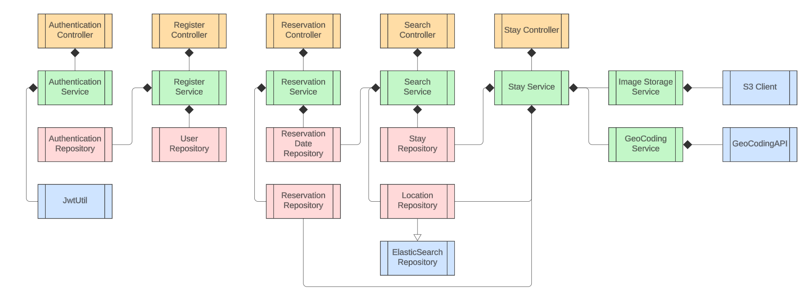
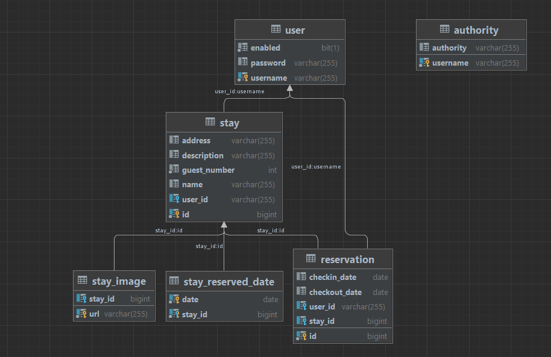

# MyStayBooking

### Introduction

#### This is an online web platform which allows user with different roles (host or guest) to either uploading stay or reservating a stay. The stay search leverages the inverted index feature from ElasticSearch to search any stay locations that are within the target distance range w.r.t the target input reference location. The stay address will be converted to geo location (longtitude, latitude) by GeoCoding API while uploading the stay, and then being saved to ElasticSearch repository to achieve geo-based search. 

---

### Backend Software Archigecture

### Backend Software Design

#### Image Upload Service

1. Call the AWS S3 client to save media files

#### Stay Upload Service

##### Add Stay
1. Upload media files to object storage by image upload service
2. Save the stay information to stay repository
3. Save the stay location to location repository (extended from ElasticSearch repository)

#### Delete Stay
1. Find the stay from stay repository
2. Check if the reservations for this stay is empty or not:
   
   2.1 Delete the stay if its reservation list is empty
   
   2.2 Throw exception if this rrservation list is not empty
   
4. Delete the stay location information from location repository (extended from ElasticSearch repository)

#### Stay Search Service

1. Search the available stay locations that are within the given distance range (search param) w.r.t given search location (search param) by location repository (extended from ElasticSeatch repository)
2. Search the reserved stays that are within the given check-in and check-out dates by reservation date repository
3. Filter out the reserved stays from available stays
4. Filter out the stays that have less available guest number than the given required guess number (search param)

#### Authentication Service

##### First Time Login

1. Check if username exists on the user repository
2. Once the username is verified, return a new generated token
   
##### Future Login

1. Add a Jwt filter to do internal check on Spring security layer
   1.1 Extract username from header information and make sure the token is within the header
   1.2 Make sure token is not expired
   1.3 Make sure the username is valid

### Database Schema Design

Authority - indicates whether the user is geust or host

User - contains user information (username, password)

Stay - contains stay information (address, descirption, max guest number, name, stay image, list of stay reservation date, list of stay reservation) 

Reservation - contains reservation information (stay id, check-in date, check-out date)

StayImage - contains stay image information (stay id, media url)

StayReservationDate - contains stay reserved date information (stay id, date)

One user can have multiple stays or reservations (1->N)

One stay can have multiple stay images, stay reserved dates, reservations (1->N)

Multiple reservations correspond to one stay (N->1)

---
### Install Elasticsearch on AWS EC2 Guideline

##### Step1: Launch AWS EC2

###### Step1.1: Select any ubuntu image with `Free tier eligible` tag for Amazon Machine Image (AMI)
###### Step1.2: Select t2.micro with `Free tier eligible` tag for instance type
###### Step1.3: Create new key pair with `RSA` key pair type and private key file format of `.pem`
###### Step1.4: Click `Allow HTTPS traffic from internest` and `Allow HTTP traffic from internest` as well on network setting
###### Step1.5: Click `Launch instance` to launche the EC2 instance
###### Step1.6: Select the `Security` tag of your EC2 instance, click your current security group, and add a new inbound rule with the follow configuration:

`IP version: IPV4`
`Type: Custom TCP`
`Protocol: TCP`
`Port range: 9200`
`Source: 0.0.0.0/0`

###### Step1.7: SSH into your EC2 instance:

`chmod 600 <Your saved private key pem file from step1.3>`

`ssh -i <Your saved private key pem file from step1.3> ubuntu@<Your EC2 instance public IP address>`

for example:

`chmod 600 ~/Download/my_key.pem`

`ssh -i ~/Download/my_key.pem ubuntu@3.16.122.94`

-----------------------------------------------------------------------

##### Step2: Instance ElasticeSearch

###### Step2.1: Install JRE: 

`sudo apt update`

`sudo apt install default-jre`

###### Step2.2: Install elasticsearch:

`sudo apt install apt-transport-https`

`wget -qO - https://artifacts.elastic.co/GPG-KEY-elasticsearch | sudo apt-key add -`

`sudo sh -c 'echo "deb https://artifacts.elastic.co/packages/7.x/apt stable main" > /etc/apt/sources.list.d/elastic-7.x.list'`

`sudo apt update`

`sudo apt install elasticsearch`

###### Step2.3: Config elasticsearch

`sudo vim /etc/elasticsearch/elasticsearch.yml`

Under network setting section:

uncomment network.host and change to `network.host: 0.0.0.0`

uncomment network.port and change to `network.port: 9200`

Under discovery section:

add `discovery.type: single-node`

Under various section:

`xpack.security.enabled: true`

###### Step2.4: Add user to your elasticsearch

`sudo /usr/share/elasticsearch/bin/elasticsearch-users useradd <username> -p <password> -r superuser`

for example:

`sudo /usr/share/elasticsearch/bin/elasticsearch-users useradd zli -p 12345678 -r superuser`

###### Step2.5: Launch your elasticsearch

`sudo systemctl start elasticsearch`

`sudo systemctl status elasticsearch`

###### Step2.6 Verify that your elasticsearch is running:

###### Method1: Open browser and type `http://<Your EC2 instance public IP address>:9200`

###### Method2: Ping your elasticsearch port:

`sudo apt-get install telnet`

`telnet <Your EC2 instance public IP address> 9200`

###### Step2.7 Open your `application.properties`, update your ES properties:

`elasticsearch.username=<Your username>`

`elasticsearch.password=<Your password>`

Maven clean and install. If you don't get any build error, it means that your ES connection is successfully. Otherwise the `ElasticsearchConfig` will complain and you can't build your application.

